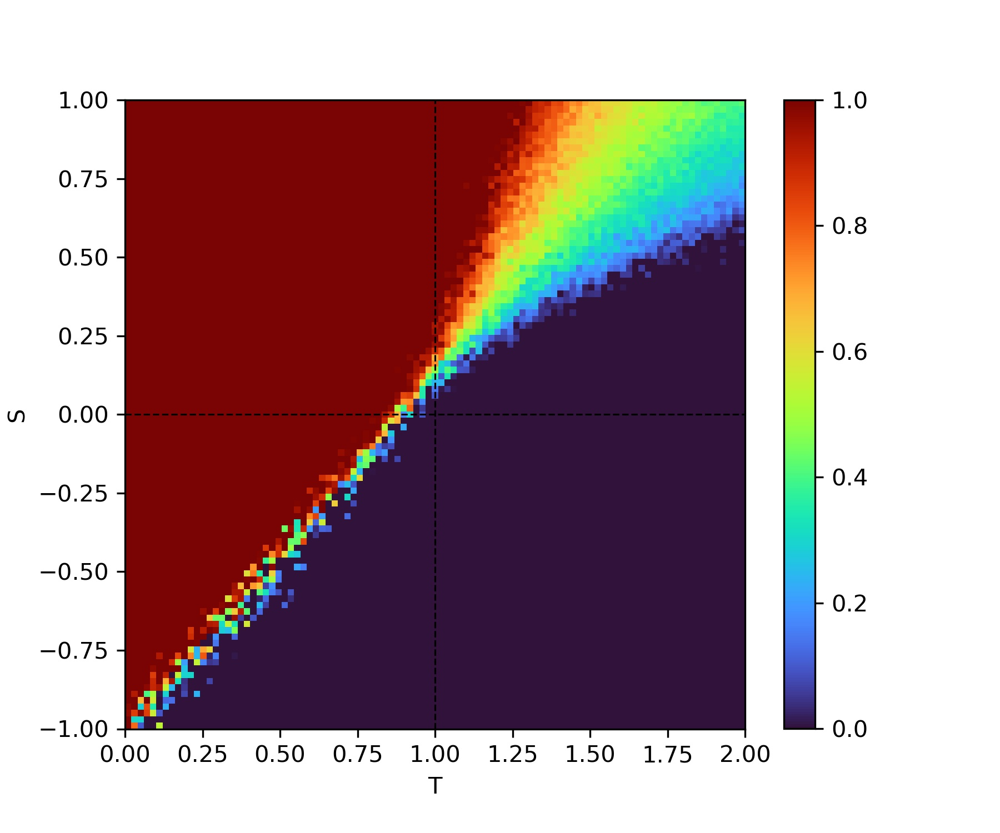

# Snowdrift Game Dynamics

This project studies the evolution of the behavior of the individuals of a community in the snowdrift game as a function of the parameters of the game and the topology of the players' social network.

## Introduction

This project seeks to build a model that simulates the dynamics of the evolution of player strategies in a community while playing a game. Each player can choose between the two available strategies to cooperate (C) or not to cooperate (D). The objective is to study how a population behaves according to the characteristics of the game.

We can classify the existing games in an ST-plane of coordinates S and T - for Sucker's and Temptation, which are the respective payoffs of a cooperator and a defector when they face each other. This would result in a payoff matrix like this one

  

By varying the values of the parameters <S, T> we change the payout matrices, so that the strategy that each player will follow will vary, obtaining the following types of games

  

Fig.1 - Game models as a function of the parameters <S,T>

## The models

When 0 < T < 1 and 0 < S &leq; 1 then regardless of the other player's decision it is in each player's interest to follow a cooperative strategy (Harmony game). If we consider a population of individuals playing a game with parameters <S, T> within these ranges, it is expected that the strategies of individuals will tend to vary towards collaboration.

If the parameters of the game are 1 < T < 2 and -1 < S < 0 we are faced with a game model known as the prisoner's dilemma that forces individuals not to collaborate with each other even if this mutual non-collaboration is the worst outcome from the point of view of the whole. If we consider a population of individuals playing a game with parameters <S, T> within these ranges, it is expected that the strategies of individuals will tend to vary towards no collaboration. 

In the other cases, contrary to the previous ones, the decisions are not absolute and the ideal strategy depends on the strategy of the other player. In the case of stag hunting, an analogy can be made with two hunters who must choose between hunting a stag (higher value) and a hare (lower value). The stag needs both hunters to be hunted while each hunter can hunt a hare on his own. The proper strategy for this game is to do the same as the other player. The result will tend towards collaboration or non-collaboration depending on the value of each prey and depending on the parameters of the game.

Finally in the snowdrift game we have an anti-coordination model where each player will try to do the opposite of what the other player does. This game can be understood as a confrontation where two drivers drive towards each other and in case that none of them turns away there will be a collision. So the best strategy is to do the opposite of what the other player does, either because if they both deviate nobody wins or because if neither deviates they both lose too much. Because in this game model the best strategy is to do the opposite of your opponent the population will not tend to a dominant state, instead once the transitional state has passed the players' strategies will oscillate between collaborating and not collaborating.
  
Below is a graph showing the proportion of players with collaborative strategies in the population. The colors tending to red show games with parameters for which players assume collaborative strategies and in blue the opposite. As we can see the games Harmony (cooperate) and Prisoner's Dilemma (betray) have a clear dominant strategy as studied.
  

  

Fig.2 - Ratio of coolaborators according to the game

Stag hunting has a mixed strategy on the one hand when the value of the shared stag is higher than a hare the players prefer to cooperate. While they will prefer not to cooperate when the hare is more valuable than half of the stag. When the Snowdrift game is shown we can see that due to the interest of each player to do the opposite of the other player, we will obtain populations with mixed strategies that will tend towards collaboration or non-collaboration depending on the type of game.

## The Conceptual Idea

The objective of this project is to study the Snowdrift game model for different networks. To do so, we will start from a network G where each node ni will represent a player. Each node will initially have a state associated with the strategy it will initially follow (cooperating or non-cooperating).

Once the experiment is initialized, each node ni will be confronted with one of its neighbors. After this, the node ni will have the option to change its strategy according to the results of the payoff matrix that it has obtained in comparison with its neighbor (if you can't beat them, join them).

This procedure will be repeated n times to reach a steady state where the changes in the proportion of cooperators in the population has stabilized. The idea is therefore to study as a function of various parameters such as the game parameters themselves and the initial density of players with a cooperative strategy how the topology of the network influences the speed of diffusion of strategies.

