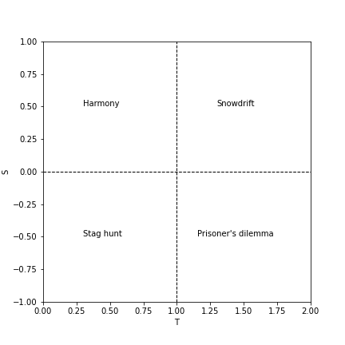

# Snowdrift Game Dynamics
This project studies the evolution of the behavior of the individuals of a community in the snowdrift game as a function of the parameters of the game and the topology of the players' social network.

## Introduction

This project seeks to build a model that simulates the dynamics of the evolution of player strategies in a community while playing a game. Each player can choose between the two available strategies to cooperate (C) or not to cooperate (D). The objective is to study how a population behaves according to the characteristics of the game.

We can classify the existing games in an ST-plane of coordinates S and T - for Sucker's and Temptation, which are the respective payoffs of a cooperator and a defector when they face each other. This would result in a payoff matrix like this one

  

By varying the values of the parameters <S, T> we change the payout matrices, so that the strategy that each player will follow will vary, obtaining the following types of games

  

 
## The models

When 0 < T < 1 and 0 < S &leq; 1 then regardless of the other player's decision it is in each player's interest to follow a cooperative strategy (Harmony game). If we consider a population of individuals playing a game with parameters <S, T> within these ranges, it is expected that the strategies of individuals will tend to vary towards collaboration.

If the parameters of the game are 1 < T < 2 and -1 < S < 0 we are faced with a game model known as the prisoner's dilemma that forces individuals not to collaborate with each other even if this mutual non-collaboration is the worst outcome from the point of view of the whole. If we consider a population of individuals playing a game with parameters <S, T> within these ranges, it is expected that the strategies of individuals will tend to vary towards no collaboration. In the other cases, contrary to the previous ones, the decisions are not absolute and the ideal strategy depends on the strategy of the other player. In the case of stag hunting, an analogy can be made with two hunters who must choose between hunting a stag (higher value) and a hare (lower value). The stag needs both hunters to be hunted while each hunter can hunt a hare on his own. The proper strategy for this game is to do the same as the other player.

The result will tend towards collaboration or non-collaboration depending on the value of each prey and depending on the parameters of the game.
